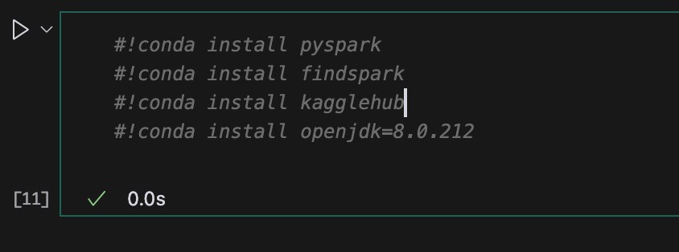
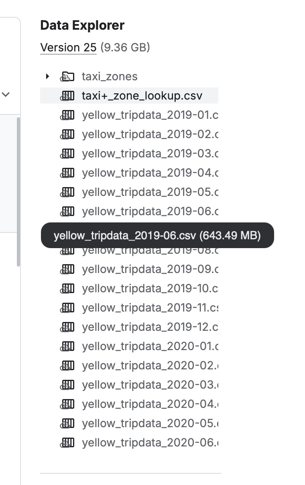
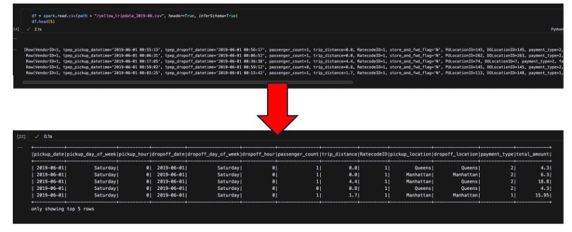

To run spark, you may need to install the dependencies in the picture below.

To run the code, please download the dataset from the following link and place the file in the same directory as the code. You only need taxi+_zone_lookup.csv and yellow_tripdata_2019-06.csv.

[New York Yellow Taxi Trip Data (2019-2020)](https://www.kaggle.com/datasets/microize/newyork-yellow-taxi-trip-data-2020-2019)

The goal is to process the raw data to make it more useful for Map Reduce and Machine Learning. See the picture below.

